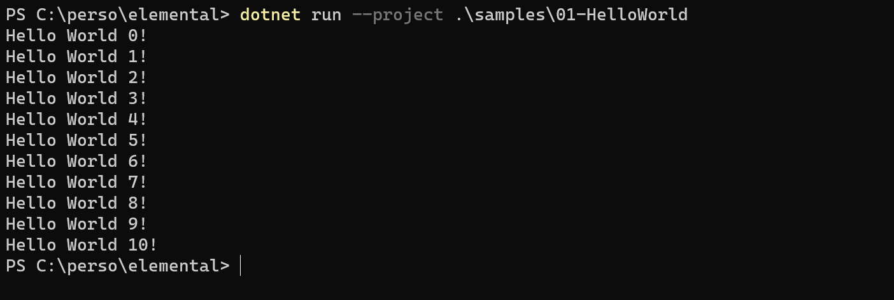
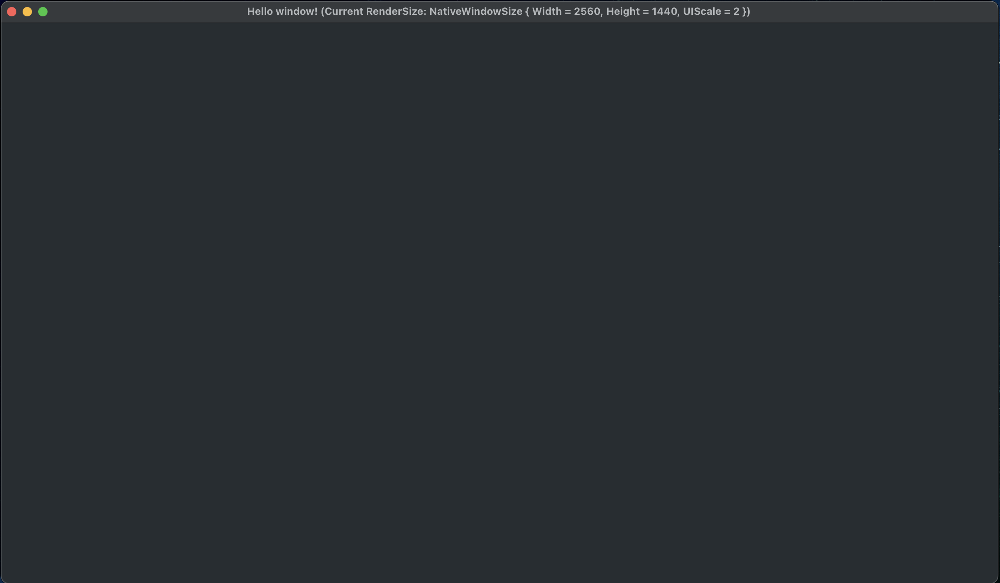

# Elemental Samples

List of available samples:

Foundations:
- [01 - Hello World](#01HelloWorld)
- [02 - Hello Window](#02HelloWindow)

Graphics:
- [01 - Hello Triangle]

## 01 - Hello World

[This sample](01-Foundations/01-HelloWorld/Program.cs) shows how to create a new native application and do some basic logic at each main loop iteration.

## 02 - HelloWindow

[This sample](01-Foundations/02-HelloWindow/Program.cs) shows how to create a new native window. It also displays the current available render width in the title bar.

## 02 - HelloWindow

[This sample](01-Foundations/02-HelloWindow/Program.cs) shows how to create a new native window. It also displays the current available render width in the title bar.

